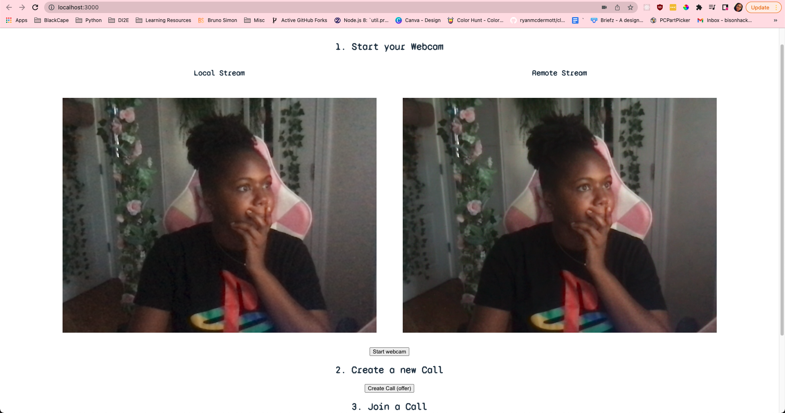
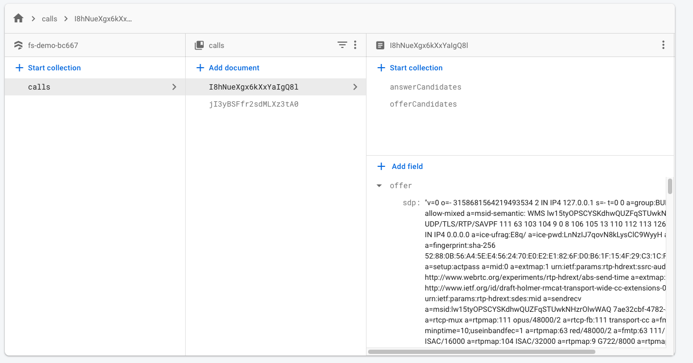

```text
                                                                                                                                                        
,--.   ,--.       ,--.       ,------. ,--------. ,-----.    ,------.                              ,------.,--.                     ,--.     ,--.        
|  |   |  | ,---. |  |-.     |  .--. ''--.  .--''  .--./    |  .-.  \  ,---. ,--,--,--. ,---.     |  .---'`--',--.--. ,---.  ,---. |  ,---. `--' ,---.  
|  |.'.|  || .-. :| .-. '    |  '--'.'   |  |   |  |        |  |  \  :| .-. :|        || .-. |    |  `--, ,--.|  .--'| .-. :(  .-' |  .-.  |,--.| .-. | 
|   ,'.   |\   --.| `-' |    |  |\  \    |  |   '  '--'\    |  '--'  /\   --.|  |  |  |' '-' '    |  |`   |  ||  |   \   --..-'  `)|  | |  ||  || '-' ' 
'--'   '--' `----' `---'     `--' '--'   `--'    `-----'    `-------'  `----'`--`--`--' `---'     `--'    `--'`--'    `----'`----' `--' `--'`--'|  |-'  
                                                                                                                                                `--'    
```
## Table of Contents
* [Overview](#overview)
* [Dependencies](#dependencies)
* [Installation](#installation)
* [Getting Started](#getting-started)
* [Things I Learned](#things-i-learned)
* [References](#references)

## Overview
Web "Real Time Communication" or "Web RTC" is an application interface that provides the ability for web browsers and mobile applications to capture and stream video/audio.

This is a project created by [FireShip](https://fireship.io/). Through their [video](https://www.youtube.com/watch?v=WmR9IMUD_CY) I got a chance to explore new technologies such as Vite and Firebase and learn about the basic components of setting up a peer-to-peer connection for streaming video/audio.  





## Dependencies
* [Firebase]()
* [NodeJS](https://nodejs.org/en/download/) v12
* NPM v6.9.0
* [ViteJS](https://vitejs.dev/)
* [NVM](https://github.com/nvm-sh/nvm)

## Installation
### Node Dependencies
2. Run `nvm use` to use the correct Node.JS version.
3. Run `npm install` to install dependencies

### Firebase
1. Create a Firebase account here.
2. Go to "**Firestore Database**" at the left side menu.
3. Select "**Project Settings**" and set the database to "Test Mode"
4. Scroll to the bottom to "**Add**" a project to the Firestore Database.
5. Type in a name for the project and select "**Web App**."
6. Copy the firebase credentials into an `.env` file using the `.env.template` as an example.

## Getting Started
1. Run `npm run dev` to start the application.
2. Go to http://localhost:3000 in two different browser window.
3. Follow the steps on the webpage to initiate a call.

## Things I Learned
### STUN Servers
"**Session Traversal Utilities for NAT**" is servers that handles communication with other servers that are behind a NAT firewall.  For using WebRTC there needs to be a STUN server so that the two peers can communicate with each other.

### Signaling Server
"**Signaling Servers**" are used to facilitate connections between devices. For this project its using Firebase to handle that by keeping two collections of "offer" and "answer" calls. Both collections store the "Session Description Protocol" and the application listens for changes on these collection to help initate the connection between the two devices. If I was to use any other database like PostgreSQL, I would have to implement websockets so that the application can poll for updates.
